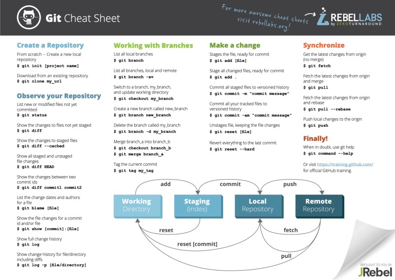

#TIL

##리눅스 명령어

1. ls

   > list (목록)

2. cd
   change directory(작업결로 병경)

3. rm
   remove(삭제)
4. mkdir
   make directory(작업목록 생성)

5. rmdir
   remove directory(작업목록 삭제)
6. touch
   파일 생성
7. cat
   파일 내용 출력

##git

1. init
   git 생성
2. add <파일명>
   staging area에 이동
3. commit -m <메세지>
   Repositoy로 이동
4. push <원격저장소><브렌치>
   원격(github)으로 데이터 이동
5. pull <원격저장소><브렌치>
   원격에서 로컬로 복사
6. clone<원격저장소><브렌치>
   원격에서 로컬로 복제
7. status
   Staging area의 상태
8. log
   repositoy의 상태
9. git commit --amenj
   바로 전 commit과 Staging area의 merge을 할떼
10. git restore --staged <파일명>
    Staging area의 파일을 working Directory로 가져옴

<!DOCTYPE html>
<html lang="en">
  <head>
    <meta charset="UTF-8" />
    <meta http-equiv="X-UA-Compatible" content="IE=edge" />
    <meta name="viewport" content="width=device-width, initial-scale=1.0" />
    <title>naver</title>
    <h2>웹 문서 구현</h2>
    
html : 문서의 구조

    
css : 문서의 스타일

    
javascript : 문서의 동적처리

   <a href="https://www.youtube.com/watch?v=Q4prXo_jkRI">하이퍼 링크</a>
    <h2>html</h2>
    
xml 태그 형태의 상위호환

    
content

    

  </head>
  <body></body>
</html>

프로그래밍 페러다임
명령형 프로그래밍(처리방법)
알고리즘 명시하고 목표는 명시안함, 절차적 프로그래밍, 객체지향 프로그래밍

선언형 프로그래밍 (무엇)
알고리즘 명시x 목표 명시, 함수령pg

절차적pg

1. 순차적인 처리방식 pg 유기적으로 연결되는 pg
2. 처리되는 속도가 빠르나 유지보구 어렵고 실행순서가 정해져 코드 순서가 바뀌면 결과 보장 어려움

객체지향 프로그래밍

1. 실제 세계를 모델링하여 pg을 객체들의 모임으로 표현한 pg
2. 캡슐화, 상속, 다양성

함수형 프로그래밍

1. 순수함수를 보조함수와 조합 후 sw를 만드는 방식
2. 일급객체, 고차,불변성,순수,합성함수

인터프리터/컴파일 언어 : 기계어로 변환하는 언어

인코딩,디코딩,문자코드
진법 : 10진수 / 2진법(기계)2,8,16
우선순위
1문자코드/ 2인코딩
문자코드 : ascll코드(7bit) -> 확장 ascll코드(8bit)/ 유니코드, euc-kr코드
문자와 숫자를 1:1 매핑시켜놓은 값

인코딩 : ascll코드(7bit) -> 확장 ascll코드(8bit)/ 유니코드(utf-8,16,32)

2진법
0 1 2 4 8 16 32
bit
byte

2진법 : 0,1/ 8진법 : 0~7/ 10진법 : 0~9/ 16진법 0~9 A(10)B(11)C(12)D(13)E(14)F(15)

Code paging = 각 나라별로 제공코드 ex) 한국 cp949
